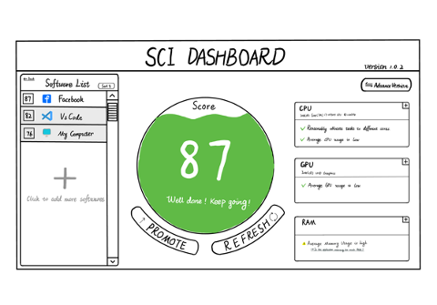

## First draft

For our first draft, we each had different visions of how the dashboard may look. We sketched these on an iPad and compared them side by side.

A group member shares their thoughts on the first concept below: "Initially, I would like to design a basic representation. There were no actual CO2 emissions. At this point, I thought only one software would be analysed at a time so I had a more focused view of the particular telemetric data."

Reflecting on the second concept: "When I designed this version of the sketch, I mainly considered the common users and professional users. Simple data displays can better meet the needs of different clients."

After discussion in the group, and combined with the client’s feedback.
We concluded that the sketch of the second concept would work better as a basis going forward.

## Final draft

We continued from the previous drafts with a few new ideas.

In response to the client's suggestions, we made a new sketch that included a server-by-server view in the dashboard. You could sort by the worst offending server and/or application

We re-worked the per-component view for one specific part (CPU):

These sketches considered the alternative views that could be presented to a common user or a professional user. In addition, it contains all data details
